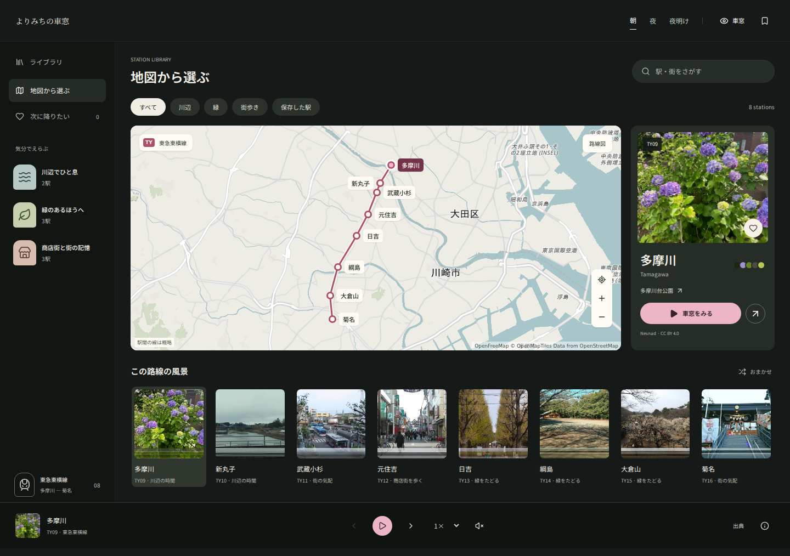

# よりみちの車窓

実写の窓枠の向こうを、写真の形と色が横ににじみながら流れるウェブアプリです。東急東横線の **多摩川〜菊名、8駅** を収録しています。




## 操作

- **窓を押す**：減速して中央の窓に元の写真を表示。もう一度押すと走行に戻ります。
- **ゆっくり見る**：にじみが弱まり、写真の形を眺められます。この間は駅が切り替わりません。「走行に戻る」で続けます。
- **速度**：0.25〜4倍。1倍で景色が窓一枚分を約0.72秒で通過します。速さに応じてにじみも変わります。
- **駅名を押す**：写真、駅名の由来、周辺の見どころ、保存ボタンを表示。
- **地図ボタン**：駅の写真をジャケットのように並べたライブラリへ。地図や写真で駅を選び、「車窓をみる」でその駅から再生。
- **駅・街をさがす**：駅名、かな、英語名、周辺スポットで検索。川辺／緑／街歩き／保存した駅で絞り込み。
- **ハート**：気になる駅を保存。「保存した駅」で一覧に。おまかせボタンでは表示中の候補から1駅を選びます。
- **地図の＋／−／全体表示**：拡大縮小と8駅への復帰。ドラッグ・ピンチ操作にも対応。「路線図」で簡略図に切り替え。
- **画面下の路線名**：駅の位置と周辺の地図を表示。
- **再生・一時停止／前後の駅／速度／車内音**：画面下から操作。
- **朝・夜・夜明け**：光の演出を切り替え。
- **ブックマーク**：「次に降りたい」駅をこのブラウザに保存。

通常走行は1駅24秒、合計約3分12秒です。景色の速度を変えても、駅が切り替わる間隔は変わりません。実際の列車の時刻や速度とは連動しません。終点では停止し、再生ボタンから最初に戻れます。写真や詳細を見ている間、バックグラウンド、画面外では車窓の動きと音を停止します。OSの「動きを減らす」が有効な場合は停止状態から始まります。

## ローカルで動かす

Node.js 22.12以降（推奨24）を使用します。

```bash
npm ci
npm run dev
```

表示：`http://localhost:5173`

```bash
npm run build
npm run preview
```

ビルドした `dist/` を静的配信できます。バックエンド、環境変数、APIキー、データベースは不要です。写真・色帯・本文フォントを同梱しています。地図画面を開いたときにのみMapLibreを遅延読み込みし、OpenFreeMapの地図・ラベルを取得します。背景地図の通信失敗やWebGL非対応時は、ローカルの簡略路線図で駅選択を続けられます。

## Vercelにデプロイ

Vercelの **Add New → Project → Import Git Repository** から `Hosi121/train-window` を選択してDeployします。

| 設定 | 値 |
| --- | --- |
| Framework Preset | Vite |
| Build Command | `npm run build` |
| Output Directory | `dist` |
| Install Command | `npm ci` |
| Environment Variables | 不要 |

`vercel.json` にビルド設定を記載しています。GitHubへの公開とVercelへのデプロイは別の操作です。

## データと素材

駅順と駅番号は[東急電鉄の公式路線図](https://www.tokyu.co.jp/railway/map/)を参照し、路線図のグラフィックは独自に作成しました。駅の位置を結んだ地図は概略図で、実際の線路形状を表すものではありません。

背景地図は[OpenFreeMap](https://openfreemap.org/quick_start/)のPositronをもとに、水面・緑地・道路の色を調整。© OpenMapTiles / OpenStreetMapの帰属表示を地図内に表示しています。地図の配信状況は外部サービスに依存します。

風景写真は実際の駅周辺を撮影したWikimedia Commonsの素材です。撮影場所、撮影者、原典、ライセンス、撮影時期を記録しています。一部は過去の写真であり、現在の街の様子と異なる場合があります。窓枠は提供された参考写真を使い、窓の内側だけをSVGマスクで抜いています。

- [写真の出典一覧](docs/SOURCES.md)
- `src/data/stations.js`：駅、座標、説明、各資料のURL
- `src/data/photo-sources.json`：写真の取得元とライセンス
- `src/data/photos.json`：配信する写真・色帯のパスと抽出色
- `public/photos/`：WebP写真
- `public/barcodes/`：写真の色から生成したSVG
- `public/window/`：提供された窓枠の写真と、表示時の開口マスク
- `src/scenery.worker.js`：写真の形を保った横方向のにじみを生成
- `public/fonts/`：アプリの文字に絞った日本語フォントとOFLライセンス

写真とその派生物には各写真の元のライセンスが適用されます。書体はNoto Sans JPとNoto Serif JP（SIL Open Font License 1.1）。環境音はWeb Audioで合成しています。本アプリは東急電鉄の公式サービスではありません。

元のイメージスケッチ一式はローカルの `reference/` にあります。窓枠として採用した写真1枚を `public/window/` にコピーし、その他のスケッチはGit管理に含めていません。窓枠の制作記録は [docs/WINDOW_ASSET.md](docs/WINDOW_ASSET.md) に記載しています。

## 素材の再生成

通常のビルドではPythonもデータ収集も不要です。素材を入れ替える場合に利用します。

```bash
python3 -m venv .venv
source .venv/bin/activate
pip install -r scripts/requirements.txt
python scripts/collect_photos.py
python scripts/build_fonts.py
```

写真を差し替える場合は `photo-sources.json` の出典を更新し、対応する `public/photos/*.webp` を入れ替えてから再生成してください。既存のWebPがない場合のみ記録されたURLから取得します。

車窓の写真はブラウザのWeb Workerで、クリア／弱／中／強の露光画像に変換します。水平方向のみをぼかし、手前に相当する下部ほどにじみを強くしています。粒子は固定した細かい粒状感として加え、フレームごとに点滅させません。走行中は生成済み画像の位置と不透明度だけを更新します。処理APIが利用できない環境では元写真の横移動に切り替わり、写真表示や駅選択を続けられます。

詳細画面とライブラリ用のカラーバーコードも保持しています。写真を180の水平な行に分け、16色に量子化した画像から代表色を抽出して横に伸ばします。5色のパレットは使用頻度と色の違いを考慮して抽出します。

## 動作確認

```bash
npx playwright install chromium
npm run build
npm test
```

デスクトップとスマートフォン相当のChromiumで、再生・停止、写真切替、8駅の移動、終点、保存・復元、検索・絞り込み、地図の選択・再試行、キーボード、動きを控える設定、アクセシビリティを検証します。地図APIをテスト用データに置き換え、背景地図の初期化と通信失敗時の両方を検証します。GitHub Actionsでも実行します。

用途の検討と今後の案は [docs/USE_CASES.md](docs/USE_CASES.md) にまとめています。
