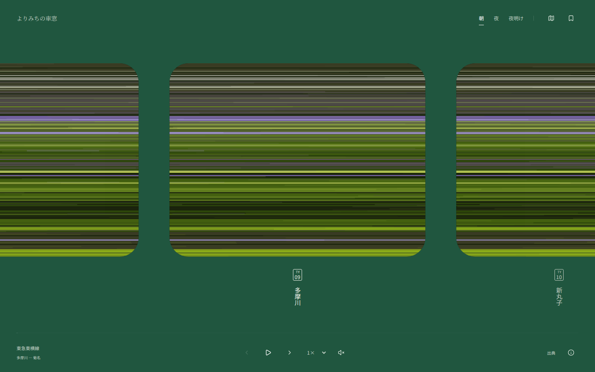

# よりみちの車窓

写真から抽出した色が、電車の窓を流れていくウェブアプリです。東急東横線の **多摩川〜菊名、8駅** を収録しています。



## 操作

- **窓を押す**：中央の窓に元の写真を表示。もう一度押すと色に戻ります。
- **駅名を押す**：写真、駅名の由来、周辺の見どころ、保存ボタンを表示。
- **地図アイコン**：空と鉄橋の路線図へ。駅を選ぶとその駅の車窓に移ります。
- **画面下の路線名**：駅の位置と周辺の地図を表示。
- **再生・一時停止／前後の駅／速度／車内音**：画面下から操作。
- **朝・夜・夜明け**：光の演出を切り替え。
- **ブックマーク**：「次に降りたい」駅をこのブラウザに保存。

1駅24秒、標準速度で約3分12秒の体験です。実際の列車の時刻や速度とは連動しません。終点では停止し、再生ボタンから最初に戻れます。写真や詳細を見ている間、バックグラウンド、画面外では車窓の動きと音を停止します。OSの「動きを減らす」が有効な場合は停止状態から始まります。

## ローカルで動かす

Node.js 22.12以降（推奨24）を使用します。

```bash
npm ci
npm run dev
```

表示：`http://localhost:5173`

```bash
npm run build
npm run preview
```

ビルドした `dist/` を静的配信できます。バックエンド、環境変数、APIキー、データベースは不要です。写真・色帯・フォントを同梱し、通常の閲覧では外部サービスを呼び出しません。周辺地図を開いた場合にのみOpenStreetMapを読み込みます。

## Vercelにデプロイ

Vercelの **Add New → Project → Import Git Repository** から `Hosi121/train-window` を選択してDeployします。

| 設定 | 値 |
| --- | --- |
| Framework Preset | Vite |
| Build Command | `npm run build` |
| Output Directory | `dist` |
| Install Command | `npm ci` |
| Environment Variables | 不要 |

`vercel.json` にビルド設定を記載しています。GitHubへの公開とVercelへのデプロイは別の操作です。

## データと素材

駅順と駅番号は[東急電鉄の公式路線図](https://www.tokyu.co.jp/railway/map/)を参照し、路線図のグラフィックは独自に作成しました。駅の位置を結んだ地図は概略図で、実際の線路形状を表すものではありません。

写真は実際の駅周辺を撮影したWikimedia Commonsの素材です。撮影場所、撮影者、原典、ライセンス、撮影時期を記録しています。一部は過去の写真であり、現在の街の様子と異なる場合があります。

- [写真の出典一覧](docs/SOURCES.md)
- `src/data/stations.js`：駅、座標、説明、各資料のURL
- `src/data/photo-sources.json`：写真の取得元とライセンス
- `src/data/photos.json`：配信する写真・色帯のパスと抽出色
- `public/photos/`：WebP写真
- `public/barcodes/`：写真の色から生成したSVG
- `public/fonts/`：アプリの文字に絞った日本語フォントとOFLライセンス

写真とその派生物には各写真の元のライセンスが適用されます。書体はNoto Sans JPとNoto Serif JP（SIL Open Font License 1.1）。環境音はWeb Audioで合成しています。本アプリは東急電鉄の公式サービスではありません。

元のイメージスケッチはローカルの `reference/` にコピーしています。公開用の素材とは分け、Git管理には含めていません。

## 素材の再生成

通常のビルドではPythonもデータ収集も不要です。素材を入れ替える場合に利用します。

```bash
python3 -m venv .venv
source .venv/bin/activate
pip install -r scripts/requirements.txt
python scripts/collect_photos.py
python scripts/build_fonts.py
```

写真を差し替える場合は `photo-sources.json` の出典を更新し、対応する `public/photos/*.webp` を入れ替えてから再生成してください。既存のWebPがない場合のみ記録されたURLから取得します。

色帯は写真を180の水平な行に分け、16色に量子化した画像から各行の代表色を抽出して横に伸ばします。元写真の局所色による控えめな筋を重ね、色帯と細い筋を異なる速度で移動させています。5色のパレットは使用頻度と色の違いを考慮して抽出します。

## 動作確認

```bash
npx playwright install chromium
npm run build
npm test
```

デスクトップとスマートフォン相当のChromiumで、再生・停止、写真切替、8駅の移動、終点、保存・復元、地図、キーボード、動きを控える設定、アクセシビリティを検証します。GitHub Actionsでも実行します。
